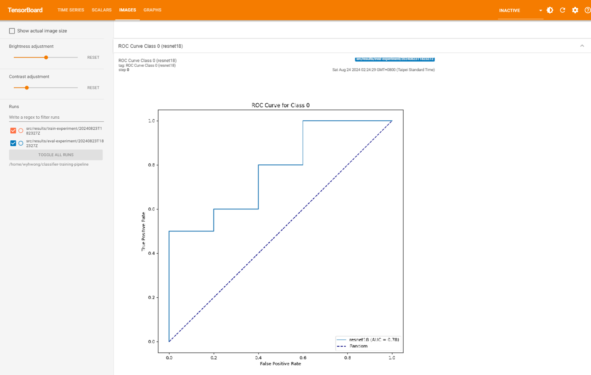
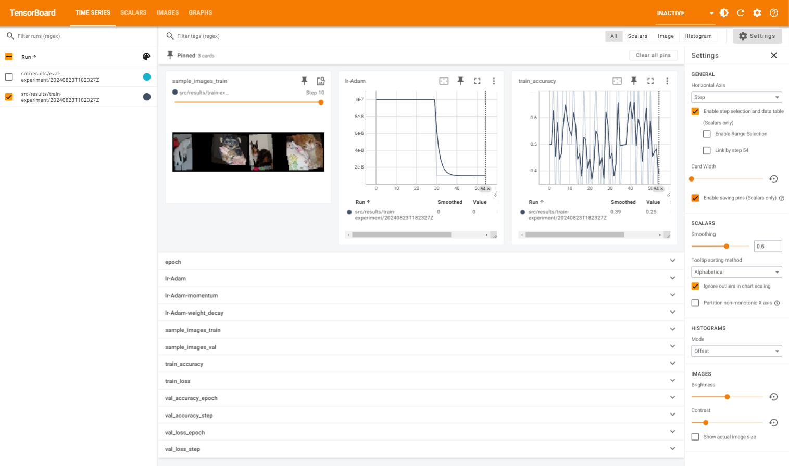
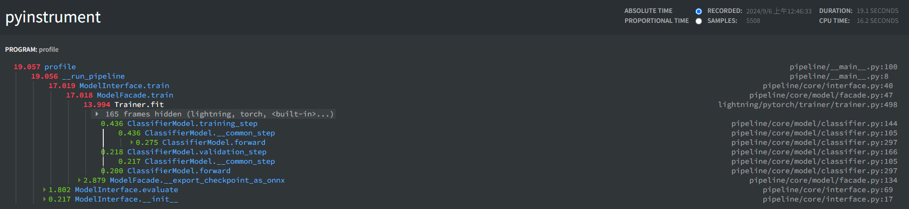

# Classifier-trains

[](https://github.com/wyhwong/classifier-trains)
[](https://pypi.org/project/classifier-trains/)
[](https://github.com/wyhwong/classifier-trains/blob/main/LICENSE)

Classifier-trains is a package aims to provide a primitive tool to finetune state-of-the-art models with PyTorch implementation, similar to Nvidia TAO but with more flexibility in augmentation and models. Like TAO classification, all parameters are configurable in yaml file to minimize the need of modifying scripts.

Goal: Get config ready, get dataset ready, no coding (hopefully :D), start PyTorch training.

## Install as a package
```bash
pip3 install classifier-trains
```

## Usage
Please see [README.md](./src/README.md) inside `src` folder.

## UML Diagram
Please see [UML Diagram](./docs/README.md) for the class diagram.

## After Training

The logs and checkpoints will be saved in the output directory, and logs are in tensorboard format. In tensorboard, you will be able to see the ROC curve, sample images in training, parameters like learning rate and momentum, and metrics like accuracy and loss.

```bash
# Run tensorboard
tensorboard --logdir <output_dir>
```





## Profile Report

If you run the training with profiling, a profile report will be generated in the output directory. You can see the time spent on each function. It gives you a better understanding of the performance of the training process, and a sense of where to optimize.



## Features To Be Developed
1. Implement detector training

## Author
[@wyhwong](https://github.com/wyhwong)
